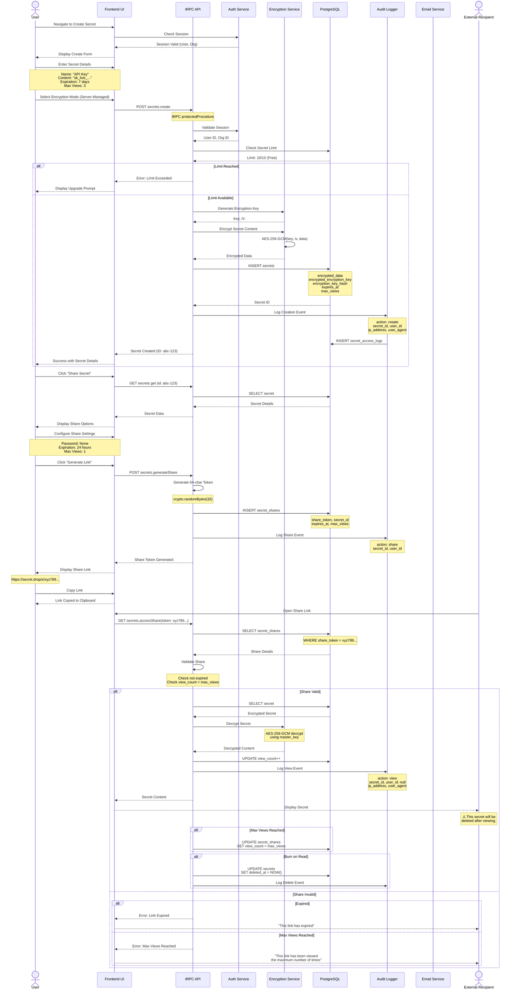

# Software Requirements Specification (SRS)
## Secure Credential Sharing System - "Secret Drop"

**Version:** 1.0  
**Date:** March 8, 2026  
**Authors:** Development Team  
**Document Status:** Final Draft

---

## Table of Contents

1. [Introduction](#1-introduction)
   - 1.1 Problem Understanding
   - 1.2 Problem Statement
   - 1.3 Existing System
   - 1.4 Proposed System

2. [Requirement Analysis](#2-requirement-analysis)
   - 2.1 Overall Description
   - 2.2 Functional Requirements
   - 2.3 Non-Functional Requirements

3. [SDLC Model Selection](#3-sdlc-model-selection)

4. [Design (UML)](#4-design-uml)

5. [References](#5-references)

---

## 1. Introduction

### 1.1 Problem Understanding

In today's digital landscape, organizations and individuals frequently need to share sensitive information such as API keys, passwords, configuration files, and temporary credentials with team members, external partners, and automated systems. Current methods of sharing this information—email, instant messaging, plain text files, or password-protected documents—are inherently insecure and pose significant security risks.

**Key Problems Identified:**

1. **Security Vulnerabilities:** Traditional communication channels are often unencrypted or logged, leaving sensitive data exposed to interception, unauthorized access, and data breaches.

2. **Lack of Control:** Once credentials are shared via traditional methods, the sender loses control over who can access them, how many times they're viewed, and for how long they remain accessible.

3. **No Audit Trail:** Most existing solutions lack comprehensive logging, making it impossible to track who accessed what information and when—critical for compliance and security investigations.

4. **Poor User Experience:** Security tools often sacrifice usability for security, leading to workarounds that compromise security.

5. **Scalability Issues:** As organizations grow, managing access permissions across multiple teams, projects, and external stakeholders becomes increasingly complex.

6. **Compliance Requirements:** Organizations must adhere to various security standards (SOC 2, HIPAA, GDPR, PCI-DSS) that require specific security controls for sensitive data handling.

### 1.2 Problem Statement

**Develop a secure, user-friendly credential sharing platform that enables organizations and individuals to share sensitive information with granular access controls, comprehensive audit logging, and end-to-end encryption while maintaining a seamless user experience.**

**Project Scope:**

The Secure Credential Sharing System (Secret Drop) will provide:

- Secure storage and sharing of secrets with AES-256 encryption
- Time-limited and view-limited access to shared secrets
- Organizational hierarchy with role-based access control (RBAC)
- Team-based collaboration within organizations
- Comprehensive audit logging for compliance
- Multiple authentication methods (email/password, SSO, 2FA)
- API access for automation and CI/CD integration
- Multi-tier subscription plans for different organizational needs

### 1.3 Existing System

#### Current Methods in Use

**Email and Instant Messaging:**
- **Advantages:** Ubiquitous, easy to use, real-time delivery
- **Disadvantages:** Messages stored on servers, logs retained indefinitely, no access control, no expiration mechanism, vulnerable to forwarding

**Password-Protected Documents:**
- **Advantages:** Can contain multiple secrets, familiar interface
- **Disadvantages:** Passwords shared insecurely, no audit trail, difficult to revoke access, version control issues

**Commercial Password Managers (1Password, LastPass, Bitwarden):**
- **Advantages:** Strong encryption, good for personal use
- **Disadvantages:** Expensive for temporary sharing, requires recipient to have account, complex permission management, not designed for one-time sharing

**Self-Hosted Solutions (HashiCorp Vault, AWS Secrets Manager):**
- **Advantages:** Enterprise-grade security, comprehensive features
- **Disadvantages:** High operational overhead, expensive, complex setup, overkill for simple sharing needs

**Paste-Based Solutions (Pastebin, PrivateBin):**
- **Advantages:** Simple, free, anonymous
- **Disadvantages:** Limited security features, no organizational features, weak audit capabilities, not designed for credentials

#### Gaps in Existing Solutions

| Feature Gap | Email/IM | Password Managers | Vault Solutions | Paste Tools |
|-------------|----------|-------------------|-----------------|-------------|
| End-to-End Encryption | ❌ | ✅ | ✅ | Partial |
| Time-Based Expiration | ❌ | ❌ | Limited | ✅ |
| View Count Limits | ❌ | ❌ | ❌ | Partial |
| Burn-on-Read | ❌ | ❌ | ❌ | Partial |
| Comprehensive Audit Logs | ❌ | Limited | ✅ | ❌ |
| Organizational Features | ❌ | Limited | ✅ | ❌ |
| Team-Based Access Control | ❌ | Limited | ✅ | ❌ |
| One-Time Sharing (No Account Required) | ✅ | ❌ | ❌ | ✅ |
| API Access | ❌ | Limited | ✅ | ❌ |
| Affordable for SMBs | ✅ | ❌ | ❌ | ✅ |

### 1.4 Proposed System

**Secret Drop** is a web-based secure credential sharing platform designed to bridge the gap between security and usability. The system provides:

#### Core Value Proposition

1. **Security-First Architecture:**
   - Client-side encryption using AES-256-GCM
   - Dual encryption modes: server-managed keys and password-derived keys
   - Zero-knowledge architecture for password-derived encryption
   - All secrets encrypted at rest and in transit

2. **Granular Access Controls:**
   - Time-based expiration (1 hour, 1 day, 7 days, 30 days, never)
   - View count limits (1, 2, 3, 5, 10, unlimited)
   - Burn-on-read (self-destruct after first view)
   - Optional password protection on share links
   - IP allowlisting for organizations

3. **Organizational Features:**
   - Multi-tenant architecture with organizations
   - Team-based hierarchy within organizations
   - Role-based access control (Owner, Admin, Member)
   - Centralized billing and management

4. **Comprehensive Audit Trail:**
   - All access logged with IP address and user agent
   - View/edit/delete/share actions tracked
   - Retention of secret metadata even after deletion
   - Exportable audit logs for compliance

5. **Flexible Authentication:**
   - Email/password with PBKDF2 (100,000 iterations)
   - Social login (Google, GitHub)
   - Organization SSO (SAML/OIDC)
   - TOTP-based two-factor authentication
   - API tokens for programmatic access

6. **Developer-Friendly:**
   - RESTful API with comprehensive documentation
   - SDK for major programming languages
   - CI/CD integration examples
   - Webhook notifications for secret events

#### Technology Stack

- **Frontend:** TanStack Start (React 19), TanStack Router, Tailwind CSS 4, Shadcn UI
- **Backend:** tRPC, Better Auth, Node.js
- **Database:** PostgreSQL with Drizzle ORM
- **Hosting:** Netlify with edge functions
- **Encryption:** Web Crypto API, @noble/ciphers
- **Payments:** Stripe (via Dodo Payments)

---

## 2. Requirement Analysis

### 2.1 Overall Description

#### 2.1.1 Product Perspective

**System Architecture:**

Secret Drop is a full-stack web application following the **JAMstack (JavaScript, APIs, Markup)** architecture pattern:

```
┌─────────────────────────────────────────────────────────────────┐
│                         Client Layer                             │
├─────────────────────────────────────────────────────────────────┤
│  React 19 SPA | TanStack Router | TanStack Query | Tailwind CSS │
└─────────────────────────────────────────────────────────────────┘
                              ↕ HTTPS/WebSocket
┌─────────────────────────────────────────────────────────────────┐
│                      API & Auth Layer                            │
├─────────────────────────────────────────────────────────────────┤
│  tRPC Endpoints | Better Auth | tRPC Middleware | Validation    │
└─────────────────────────────────────────────────────────────────┘
                              ↕
┌─────────────────────────────────────────────────────────────────┐
│                       Data Layer                                 │
├─────────────────────────────────────────────────────────────────┤
│  PostgreSQL | Drizzle ORM | Encryption Service | Audit Logger   │
└─────────────────────────────────────────────────────────────────┘
```

**External Interfaces:**

1. **User Interface:** Web browser (Chrome, Firefox, Safari, Edge) - Modern versions with ES2022 support
2. **API Interface:** RESTful API for third-party integrations
3. **Authentication Providers:** OAuth providers (Google, GitHub), SAML IdPs (Okta, Azure AD)
4. **Payment Gateway:** Stripe for subscription management
5. **Email Service:** Transactional emails for notifications

#### 2.1.2 Product Functions

| Function Category | Description |
|-------------------|-------------|
| **Authentication** | User registration, login, logout, password recovery, SSO, 2FA |
| **Secret Management** | Create, read, update, delete, list secrets with encryption |
| **Secret Sharing** | Generate shareable links with expiration and view limits |
| **Organization Management** | Create/ manage organizations, invite members, assign roles |
| **Team Management** | Create teams within organizations, manage team membership |
| **Access Control** | Role-based permissions, IP allowlisting, team-based access |
| **Audit & Compliance** | View access logs, export reports, track secret lifecycle |
| **Developer API** | API token management, programmatic secret access |
| **Billing** | Subscription management, payment processing, plan upgrades |

#### 2.1.3 User Classes and Characteristics

| User Class | Description | Key Needs | Technical Proficiency |
|------------|-------------|-----------|----------------------|
| **Individual Users** | Freelancers, developers sharing personal credentials | Quick sharing, minimal setup, free tier | Medium-High |
| **Team Members** | Employees within an organization | Collaborative sharing, team secrets, audit logs | Medium |
| **Organization Admins** | Owners/IT administrators managing org settings | User management, SSO, compliance reporting, billing | High |
| **External Recipients** | Non-users receiving shared secrets | Easy access (no account required), clear instructions | Low-Medium |
| **Developers/CI/CD** | Automated systems accessing secrets via API | Reliable API, webhook notifications, secure token storage | High |
| **Compliance Officers** | Auditors reviewing security practices | Comprehensive audit trails, export capabilities | Medium |

#### 2.1.4 Assumptions & Constraints

**Assumptions:**

1. Users have modern web browsers with JavaScript enabled
2. Users have internet connectivity for web and API access
3. Organization administrators have basic understanding of security practices
4. Email delivery is reliable for user notifications
5. PostgreSQL database can handle projected load with proper indexing
6. Netlify edge functions can handle API request volume
7. Stripe API remains available for payment processing

**Constraints:**

1. **Technical Constraints:**
   - Must use approved technology stack (TanStack, tRPC, Drizzle ORM)
   - Must maintain compatibility with Netlify hosting platform
   - Database schema changes require migration scripts
   - Client-side encryption limited to browser Web Crypto API capabilities

2. **Security Constraints:**
   - All secrets must be encrypted at rest (AES-256)
   - All API communication must use HTTPS
   - Must comply with SOC 2, GDPR, PCI-DSS requirements
   - No plaintext secrets in server logs
   - Master encryption key must be secured via environment variables

3. **Business Constraints:**
   - Free tier limited to 10 secrets per organization
   - Pro tier limited to 100 secrets per organization
   - Maximum secret size: 1 MB
   - Maximum share link expiration: 30 days
   - API rate limits: 100 requests/minute for free tier

4. **Regulatory Constraints:**
   - GDPR compliance for EU users (right to deletion, data export)
   - CCPA compliance for California residents
   - Data retention: Audit logs minimum 90 days, maximum 7 years

5. **Performance Constraints:**
   - API response time: < 200ms (p95)
   - Page load time: < 2 seconds
   - Support 10,000 concurrent users
   - 99.9% uptime SLA for paid tiers

### 2.2 Functional Requirements

#### Authentication & Authorization (FR-AUTH)

| ID | Requirement | Priority |
|----|-------------|----------|
| **FR-AUTH-001** | The system shall allow users to register with email and password | High |
| **FR-AUTH-002** | The system shall allow users to log in with email/password or OAuth providers (Google, GitHub) | High |
| **FR-AUTH-003** | The system shall support password reset via email verification link | High |
| **FR-AUTH-004** | The system shall enforce password minimum length of 8 characters | High |
| **FR-AUTH-005** | The system shall hash passwords using PBKDF2 with 100,000 iterations | High |
| **FR-AUTH-006** | The system shall support TOTP-based two-factor authentication | Medium |
| **FR-AUTH-007** | The system shall allow users to generate and manage backup codes for 2FA recovery | Medium |
| **FR-AUTH-008** | The system shall support session management with configurable expiration | High |
| **FR-AUTH-009** | The system shall support organization-level SSO via SAML 2.0 or OIDC | Medium |
| **FR-AUTH-010** | The system shall implement role-based access control with roles: Owner, Admin, Member | High |
| **FR-AUTH-011** | The system shall allow API token creation with name and optional expiration | Medium |
| **FR-AUTH-012** | The system shall display API token prefix (first 8 characters) for identification | Medium |
| **FR-AUTH-013** | The system shall track last used timestamp for API tokens | Low |
| **FR-AUTH-014** | The system shall allow API token revocation | High |

#### Secret Management (FR-SECRET)

| ID | Requirement | Priority |
|----|-------------|----------|
| **FR-SECRET-001** | The system shall allow authenticated users to create secrets within their organization | High |
| **FR-SECRET-002** | The system shall encrypt all secrets using AES-256-GCM before storage | High |
| **FR-SECRET-003** | The system shall support two encryption modes: server-managed keys and password-derived keys | High |
| **FR-SECRET-004** | The system shall allow users to set secret name up to 255 characters | Medium |
| **FR-SECRET-005** | The system shall allow secret content up to 1 MB in size | High |
| **FR-SECRET-006** | The system shall allow users to assign secrets to teams within their organization | Medium |
| **FR-SECRET-007** | The system shall allow users to view secrets they have access to | High |
| **FR-SECRET-008** | The system shall allow users to edit secret names and content | High |
| **FR-SECRET-009** | The system shall allow users to delete secrets (soft delete) | High |
| **FR-SECRET-010** | The system shall allow owners to set expiration time: 1 hour, 1 day, 7 days, 30 days, or never | High |
| **FR-SECRET-011** | The system shall allow owners to set maximum view count: 1, 2, 3, 5, 10, or unlimited | High |
| **FR-SECRET-012** | The system shall support burn-on-read mode where secrets delete after first view | High |
| **FR-SECRET-013** | The system shall increment view count on each secret access | High |
| **FR-SECRET-014** | The system shall prevent access to expired secrets | High |
| **FR-SECRET-015** | The system shall prevent access to secrets that have reached max view count | High |
| **FR-SECRET-016** | The system shall allow users to list all secrets in their organization | High |
| **FR-SECRET-017** | The system shall allow filtering secrets by team, creation date, expiration status | Medium |
| **FR-SECRET-018** | The system shall allow searching secrets by name | Medium |

#### Secret Sharing (FR-SHARE)

| ID | Requirement | Priority |
|----|-------------|----------|
| **FR-SHARE-001** | The system shall allow users to generate shareable links for secrets | High |
| **FR-SHARE-002** | The system shall generate unique 64-character tokens for share links | High |
| **FR-SHARE-003** | The system shall allow users to set optional password protection on share links | Medium |
| **FR-SHARE-004** | The system shall allow users to set expiration time on share links independent of secret expiration | High |
| **FR-SHARE-005** | The system shall allow users to set maximum view count on share links | High |
| **FR-SHARE-006** | The system shall allow anonymous access to secrets via valid share links | High |
| **FR-SHARE-007** | The system shall require password if share link is password-protected | High |
| **FR-SHARE-008** | The system shall track view count per share link | High |
| **FR-SHARE-009** | The system shall prevent access to expired share links | High |
| **FR-SHARE-010** | The system shall prevent access to share links that have reached max view count | High |
| **FR-SHARE-011** | The system shall allow users to revoke share links | High |
| **FR-SHARE-012** | The system shall allow users to view all active share links for a secret | Medium |

#### Organization Management (FR-ORG)

| ID | Requirement | Priority |
|----|-------------|----------|
| **FR-ORG-001** | The system shall allow users to create organizations with unique name and slug | High |
| **FR-ORG-002** | The system shall allow users to upload organization logo | Low |
| **FR-ORG-003** | The system shall allow organization owners to invite members via email | High |
| **FR-ORG-004** | The system shall allow owners to assign roles (Owner, Admin, Member) to members | High |
| **FR-ORG-005** | The system shall allow admins to manage member roles | High |
| **FR-ORG-006** | The system shall prevent members from modifying roles | High |
| **FR-ORG-007** | The system shall allow owners and admins to remove members | High |
| **FR-ORG-008** | The system shall allow members to leave organizations | Medium |
| **FR-ORG-009** | The system shall allow users to switch between active organizations | High |
| **FR-ORG-010** | The system shall allow users to be members of multiple organizations | High |
| **FR-ORG-011** | The system shall enforce secret limits based on subscription tier | High |
| **FR-ORG-012** | The system shall track organization creation and update timestamps | Medium |

#### Team Management (FR-TEAM)

| ID | Requirement | Priority |
|----|-------------|----------|
| **FR-TEAM-001** | The system shall allow organization admins to create teams | High |
| **FR-TEAM-002** | The system shall require teams to have a name | High |
| **FR-TEAM-003** | The system shall allow optional team description | Low |
| **FR-TEAM-004** | The system shall allow admins to add members to teams | High |
| **FR-TEAM-005** | The system shall allow team members to access team secrets | High |
| **FR-TEAM-006** | The system shall allow admins to remove members from teams | High |
| **FR-TEAM-007** | The system shall allow admins to delete teams | High |
| **FR-TEAM-008** | The system shall prevent deletion of teams that have secrets (unless secrets reassigned) | Medium |

#### Audit Logging (FR-AUDIT)

| ID | Requirement | Priority |
|----|-------------|----------|
| **FR-AUDIT-001** | The system shall log all secret view actions with timestamp and user ID | High |
| **FR-AUDIT-002** | The system shall log all secret edit actions with timestamp and user ID | High |
| **FR-AUDIT-003** | The system shall log all secret delete actions with timestamp and user ID | High |
| **FR-AUDIT-004** | The system shall log all secret share actions with timestamp and user ID | High |
| **FR-AUDIT-005** | The system shall capture IP address for all logged actions | High |
| **FR-AUDIT-006** | The system shall capture user agent for all logged actions | Medium |
| **FR-AUDIT-007** | The system shall allow organization admins to view audit logs for their organization | High |
| **FR-AUDIT-008** | The system shall allow filtering audit logs by action type, date range, user | Medium |
| **FR-AUDIT-009** | The system shall allow exporting audit logs as CSV | Medium |
| **FR-AUDIT-010** | The system shall retain secret name and owner in audit logs even after secret deletion | High |
| **FR-AUDIT-011** | The system shall retain audit logs for minimum 90 days | High |

#### Access Control & Security (FR-SECURITY)

| ID | Requirement | Priority |
|----|-------------|----------|
| **FR-SECURITY-001** | The system shall allow organization admins to configure IP allowlist | Medium |
| **FR-SECURITY-002** | The system shall support IPv4 and IPv6 CIDR notation in allowlist | Medium |
| **FR-SECURITY-003** | The system shall block access from IPs not in allowlist when configured | High |
| **FR-SECURITY-004** | The system shall allow admins to add allowlist entries with descriptions | Low |
| **FR-SECURITY-005** | The system shall allow admins to remove allowlist entries | Medium |
| **FR-SECURITY-006** | The system shall encrypt all secrets at rest using AES-256-GCM | High |
| **FR-SECURITY-007** | The system shall use unique initialization vector (IV) for each encryption | High |
| **FR-SECURITY-008** | The system shall support master key rotation for server-managed encryption | Medium |
| **FR-SECURITY-009** | The system shall store SSO client secrets encrypted at rest | High |
| **FR-SECURITY-010** | The system shall validate encryption key hash before decryption | High |

#### Trash & Recovery (FR-TRASH)

| ID | Requirement | Priority |
|----|-------------|----------|
| **FR-TRASH-001** | The system shall move deleted secrets to trash bin instead of permanent deletion | Medium |
| **FR-TRASH-002** | The system shall store original data in JSON format in trash bin | Medium |
| **FR-TRASH-003** | The system shall record user who performed deletion | Medium |
| **FR-TRASH-004** | The system shall allow organization admins to view trash bin contents | Medium |
| **FR-TRASH-005** | The system shall allow admins to restore items from trash | Medium |
| **FR-TRASH-006** | The system shall allow admins to permanently delete items from trash | Low |
| **FR-TRASH-007** | The system shall auto-permanently-delete items after 30 days in trash | Low |

#### Billing & Subscriptions (FR-BILLING)

| ID | Requirement | Priority |
|----|-------------|----------|
| **FR-BILLING-001** | The system shall support three subscription tiers: Free, Pro Team, Business | High |
| **FR-BILLING-002** | The system shall enforce 10 secret limit for free tier | High |
| **FR-BILLING-003** | The system shall enforce 100 secret limit for Pro Team tier | High |
| **FR-BILLING-004** | The system shall provide unlimited secrets for Business tier | High |
| **FR-BILLING-005** | The system shall integrate with Stripe for payment processing | High |
| **FR-BILLING-006** | The system shall allow users to upgrade subscription tier | High |
| **FR-BILLING-007** | The system shall allow users to downgrade subscription tier | Medium |
| **FR-BILLING-008** | The system shall prorate subscription changes | Medium |
| **FR-BILLING-009** | The system shall send payment failure notifications | High |
| **FR-BILLING-010** | The system shall allow users to update payment methods | Medium |
| **FR-BILLING-011** | The system shall display invoice history | Medium |
| **FR-BILLING-012** | The system shall allow downloading PDF invoices | Medium |

#### User Preferences (FR-PREFS)

| ID | Requirement | Priority |
|----|-------------|----------|
| **FR-PREFS-001** | The system shall allow users to set theme preference: light, dark, system | Low |
| **FR-PREFS-002** | The system shall allow users to set default organization | Medium |
| **FR-PREFS-003** | The system shall allow users to update their name | Medium |
| **FR-PREFS-004** | The system shall allow users to update their email | Medium |
| **FR-PREFS-005** | The system shall allow users to upload profile image | Low |
| **FR-PREFS-006** | The system shall allow users to add bio text | Low |

#### API Access (FR-API)

| ID | Requirement | Priority |
|----|-------------|----------|
| **FR-API-001** | The system shall provide RESTful API for all secret operations | High |
| **FR-API-002** | The system shall support API token authentication via Bearer token | High |
| **FR-API-003** | The system shall enforce rate limits: 100 req/min for free, 1000 req/min for paid | High |
| **FR-API-004** | The system shall return HTTP status codes appropriately | High |
| **FR-API-005** | The system shall provide API documentation | High |
| **FR-API-006** | The system shall support pagination for list endpoints | Medium |
| **FR-API-007** | The system shall include audit logging for API requests | High |

### 2.3 Non-Functional Requirements

#### 2.3.1 Performance Requirements

| ID | Requirement | Metric | Priority |
|----|-------------|--------|----------|
| **NFR-PERF-001** | API Response Time | p95 < 200ms | High |
| **NFR-PERF-002** | API Response Time | p99 < 500ms | High |
| **NFR-PERF-003** | Page Load Time | Initial render < 2 seconds | High |
| **NFR-PERF-004** | Time to Interactive | < 3 seconds | High |
| **NFR-PERF-005** | Concurrent User Support | 10,000 simultaneous users | High |
| **NFR-PERF-006** | Database Query Time | p95 < 100ms for indexed queries | High |
| **NFR-PERF-007** | Encryption/Decryption Time | < 50ms for 1MB payload | Medium |
| **NFR-PERF-008** | Secret Creation Latency | End-to-end < 1 second | Medium |
| **NFR-PERF-009** | Search Performance | < 200ms for 10,000 secrets | Medium |

#### 2.3.2 Security Requirements

| ID | Requirement | Priority |
|----|-------------|----------|
| **NFR-SEC-001** | All data in transit must be encrypted using TLS 1.3 | High |
| **NFR-SEC-002** | All secrets must be encrypted at rest using AES-256-GCM | High |
| **NFR-SEC-003** | Passwords must be hashed using PBKDF2 with minimum 100,000 iterations | High |
| **NFR-SEC-004** | Authentication session tokens must be cryptographically secure random strings | High |
| **NFR-SEC-005** | API tokens must be at least 64 characters cryptographically secure random | High |
| **NFR-SEC-006** | Share tokens must be at least 64 characters cryptographically secure random | High |
| **NFR-SEC-007** | System must implement protection against SQL injection | High |
| **NFR-SEC-008** | System must implement protection against XSS attacks | High |
| **NFR-SEC-009** | System must implement protection against CSRF attacks | High |
| **NFR-SEC-010** | System must implement rate limiting on authentication endpoints | High |
| **NFR-SEC-011** | System must implement brute-force protection on login (5 attempts per 15 minutes) | High |
| **NFR-SEC-012** | System must not log secret content at any point | High |
| **NFR-SEC-013** | System must implement Content Security Policy (CSP) headers | Medium |
| **NFR-SEC-014** | System must implement HTTP Strict Transport Security (HSTS) | High |
| **NFR-SEC-015** | Master encryption keys must be stored in environment variables, never in code | High |
| **NFR-SEC-016** | System must conduct annual security audits | High |
| **NFR-SEC-017** | System must comply with SOC 2 Type II requirements | High |
| **NFR-SEC-018** | System must comply with GDPR data protection requirements | High |

#### 2.3.3 Usability Requirements

| ID | Requirement | Priority |
|----|-------------|----------|
| **NFR-USE-001** | Interface must be accessible via WCAG 2.1 AA standards | Medium |
| **NFR-USE-002** | Application must be responsive on mobile devices (320px - 768px) | High |
| **NFR-USE-003** | Application must be responsive on tablet devices (768px - 1024px) | High |
| **NFR-USE-004** | Application must be responsive on desktop devices (> 1024px) | High |
| **NFR-USE-005** | Critical user flows (create secret, share secret) must be completable in < 5 clicks | High |
| **NFR-USE-006** | System must provide inline validation for form inputs | Medium |
| **NFR-USE-007** | System must provide clear error messages with actionable guidance | High |
| **NFR-USE-008** | System must support keyboard navigation | Medium |
| **NFR-USE-009** | System must provide user onboarding for first-time users | Medium |
| **NFR-USE-010** | System must maintain consistency in UI patterns across pages | High |

#### 2.3.4 Reliability Requirements

| ID | Requirement | Metric | Priority |
|----|-------------|--------|----------|
| **NFR-REL-001** | System Uptime (Free Tier) | 99.0% (~3.65 days downtime/year) | Medium |
| **NFR-REL-002** | System Uptime (Paid Tiers) | 99.9% (~8.7 hours downtime/year) | High |
| **NFR-REL-003** | Data Durability | 99.999999999% (11 nines) | High |
| **NFR-REL-004** | Mean Time Between Failures (MTBF) | > 720 hours | Medium |
| **NFR-REL-005** | Mean Time To Recovery (MTTR) | < 1 hour | High |
| **NFR-REL-006** | Backup Frequency | Daily automated backups | High |
| **NFR-REL-007** | Point-in-Time Recovery | Recovery to any point within 30 days | High |
| **NFR-REL-008** | Disaster Recovery RTO | < 4 hours | Medium |
| **NFR-REL-009** | Disaster Recovery RPO | < 1 hour | Medium |

#### 2.3.5 Maintainability Requirements

| ID | Requirement | Priority |
|----|-------------|----------|
| **NFR-MAIN-001** | Code must follow project style guidelines (AGENTS.md) | High |
| **NFR-MAIN-002** | Code must have minimum 70% test coverage | High |
| **NFR-MAIN-003** | Critical paths must have minimum 90% test coverage | High |
| **NFR-MAIN-004** | All new features must include automated tests | High |
| **NFR-MAIN-005** | Code must pass linting before merge | High |
| **NFR-MAIN-006** | API changes must maintain backward compatibility or use versioning | High |
| **NFR-MAIN-007** | Database migrations must be reversible | Medium |
| **NFR-MAIN-008** | System must have automated deployment pipeline | Medium |
| **NFR-MAIN-009** | System must have health check endpoints | High |
| **NFR-MAIN-010** | System must implement structured logging for debugging | Medium |
| **NFR-MAIN-011** | System must have documentation for all API endpoints | High |
| **NFR-MAIN-012** | Code must be reviewed by at least one other developer before merge | High |

#### 2.3.6 Scalability Requirements

| ID | Requirement | Priority |
|----|-------------|----------|
| **NFR-SCALE-001** | System must support horizontal scaling of API servers | High |
| **NFR-SCALE-002** | Database must support read replicas for reporting queries | Medium |
| **NFR-SCALE-003** | Static assets must be served via CDN | High |
| **NFR-SCALE-004** | System must implement connection pooling for database | High |
| **NFR-SCALE-005** | System must cache frequently accessed data (user sessions, org settings) | Medium |

---

## 3. SDLC Model Selection

### 3.1 Selected SDLC Model

**Agile Methodology with Scrum Framework**

The Secret Drop project will use **Agile development with Scrum framework**, organized in 2-week sprints with the following ceremony structure:

- **Sprint Planning:** 2 hours at start of each sprint
- **Daily Standups:** 15 minutes daily
- **Sprint Review:** 1 hour at end of each sprint
- **Sprint Retrospective:** 30 minutes at end of each sprint
- **Backlog Refinement:** Ongoing, 1 hour per week

### 3.2 Justification

#### Why Agile?

| Factor | Alignment with Secret Drop |
|--------|---------------------------|
| **Rapidly Evolving Security Threats** | Agile allows quick incorporation of security patches and new encryption standards |
| **User Feedback Driven** | Secret sharing UX benefits from iterative testing with real users |
| **Market Uncertainty** | Feature prioritization can adapt based on subscription metrics |
| **Technology Stack Modernity** | Frequent updates to TanStack, React, Drizzle require agile adaptation |
| **Small Team** | Agile ceremonies optimize for small, cross-functional teams |

#### Why Scrum Specifically?

1. **Time-Boxed Iterations:** 
   - 2-week sprints balance velocity with stability
   - Regular delivery cadence supports continuous deployment to Netlify

2. **Roles Clarity:**
   - Product Owner: Manages backlog, stakeholder communication
   - Scrum Master: Facilitates ceremonies, removes blockers
   - Development Team: Cross-functional (frontend, backend, DevOps)

3. **Artifact Structure:**
   - Product Backlog: Prioritized features (FR-XXXX requirements)
   - Sprint Backlog: Committed work for current sprint
   - Increment: Potentially releasable software every sprint

#### Adaptations for Secret Drop

**DevOps Integration:**
- Continuous Integration: GitHub Actions run tests on every PR
- Continuous Deployment: Auto-deploy to Netlify on merge to main
- Feature Flags: Use environment variables for gradual rollout

**Security Integration:**
- Security backlog items treated as highest priority
- Security testing included in Definition of Done
- Quarterly security assessments create additional backlog items

**Compliance Considerations:**
- Documentation requirements for SOC 2 / GDPR built into DoD
- Audit trail requirements validated in Sprint Review

#### Alternative Models Considered

| Model | Advantages | Disadvantages | Decision |
|-------|------------|---------------|----------|
| **Waterfall** | Clear phases, documented | Too rigid, slow feedback | ❌ Rejected |
| **Kanban** | Continuous flow, flexible | Lack time-boxing, harder to plan releases | ❌ Rejected |
| **Spiral** | Risk-focused, iterative | Complex for small team, heavy documentation | ❌ Rejected |
| **Scrum** | Time-boxed, collaborative, proven | Requires discipline, ceremony overhead | ✅ **Selected** |

---

## 4. Design (UML)

### 4.1 UML Diagrams

#### 4.1.1 Use Case Diagram

```mermaid
graph TB
    subgraph "Authentication Layer"
        UC1[Register]
        UC2[Login]
        UC3[Logout]
        UC4[Reset Password]
        UC5[Configure 2FA]
        UC6[Manage API Tokens]
    end

    subgraph "Secret Management"
        UC7[Create Secret]
        UC8[View Secret]
        UC9[Edit Secret]
        UC10[Delete Secret]
        UC11[List Secrets]
        UC12[Search Secrets]
    end

    subgraph "Secret Sharing"
        UC13[Generate Share Link]
        UC14[Access Shared Secret]
        UC15[Revoke Share Link]
        UC16[Set Share Password]
    end

    subgraph "Organization Management"
        UC17[Create Organization]
        UC18[Invite Members]
        UC19[Assign Roles]
        UC20[Manage Teams]
        UC21[Configure SSO]
        UC22[Configure IP Allowlist]
    end

    subgraph "Audit & Compliance"
        UC23[View Audit Logs]
        UC24[Export Audit Logs]
        UC25[Generate Compliance Report]
    end

    subgraph "Billing"
        UC26[Subscribe to Plan]
        UC27[Upgrade/Downgrade]
        UC28[Manage Payment Methods]
        UC29[View Invoices]
    end

    subgraph "Actors"
        A1((Anonymous User))
        A2((Authenticated User))
        A3((Organization Admin))
        A4((External Recipient))
        A5((API Client))
    end

    %% Actor relationships
    A1 -->|can perform| UC1
    A1 -->|can perform| UC2
    A1 -->|can perform| UC4
    A1 -->|can perform| UC14
    
    A2 -->|can perform| UC3
    A2 -->|can perform| UC5
    A2 -->|can perform| UC6
    A2 -->|can perform| UC7
    A2 -->|can perform| UC8
    A2 -->|can perform| UC9
    A2 -->|can perform| UC10
    A2 -->|can perform| UC11
    A2 -->|can perform| UC12
    A2 -->|can perform| UC13
    A2 -->|can perform| UC15
    A2 -->|can perform| UC16
    A2 -->|can perform| UC23
    
    A3 -->|can perform| UC17
    A3 -->|can perform| UC18
    A3 -->|can perform| UC19
    A3 -->|can perform| UC20
    A3 -->|can perform| UC21
    A3 -->|can perform| UC22
    A3 -->|can perform| UC24
    A3 -->|can perform| UC25
    A3 -->|can perform| UC26
    A3 -->|can perform| UC27
    A3 -->|can perform| UC28
    A3 -->|can perform| UC29
    
    A4 -->|can perform| UC14
    
    A5 -->|can perform| UC2
    A5 -->|can perform| UC6
    A5 -->|can perform| UC8
    A5 -->|can perform| UC11
    A5 -->|can perform| UC14

    style A1 fill:#e1f5fe
    style A2 fill:#c8e6c9
    style A3 fill:#fff9c4
    style A4 fill:#e1f5fe
    style A5 fill:#f8bbd0
```



**Use Case Diagram Explanation:**

The system distinguishes between five primary actors:

1. **Anonymous User:** Unauthenticated visitors who can register, login, reset password, and access secrets via shared links
2. **Authenticated User:** Regular users with full access to secret management, sharing, and personal settings
3. **Organization Admin:** Privileged users who can manage organizations, members, teams, SSO, and billing
4. **External Recipient:** Non-users who receive share links and can access secrets without accounts
5. **API Client:** Programmatic access using API tokens for automation and CI/CD integration

The diagram shows inheritance relationships (Admin is a User, API Client acts like User) and the core use cases grouped by functional area.

#### 4.1.2 Use Case Description

**Use Case: UC-007 - Create Secret**

| Field | Description |
|-------|-------------|
| **Use Case ID** | UC-007 |
| **Name** | Create Secret |
| **Actor** | Authenticated User |
| **Preconditions** | User is logged in; User belongs to an organization; Organization has not reached secret limit |
| **Main Flow** | 1. User navigates to "Create Secret" page<br>2. User enters secret name (required)<br>3. User enters secret content (required, max 1MB)<br>4. System validates inputs<br>5. User selects encryption mode (default: server-managed)<br>6. If password-derived: User enters password<br>7. System encrypts content client-side<br>8. User selects expiration (default: 7 days)<br>9. User selects max views (default: unlimited)<br>10. User optionally selects team access<br>11. User clicks "Create Secret"<br>12. System saves encrypted secret to database<br>13. System logs creation event<br>14. User receives success message with secret ID |
| **Alternative Flows** | **A1: Organization Limit Reached**<br>- Step 12: System detects limit exceeded<br>- System displays error with upgrade prompt<br>- Use case ends<br><br>**A2: Encryption Failure**<br>- Step 7: Encryption fails<br>- System displays error with troubleshooting steps<br>- Use case ends<br><br>**A3: Network Error**<br>- Step 12: API request fails<br>- System displays "Retry" option<br>- User may retry or cancel |
| **Postconditions** | Secret stored in database; Audit log entry created; User can view secret in list |
| **Business Rules** | BR-001: Free tier limited to 10 secrets<br>BR-002: Pro tier limited to 100 secrets<br>BR-003: Secret content max 1MB<br>BR-004: Secret name required, max 255 chars |
| **Functional Requirements** | FR-SECRET-001, FR-SECRET-002, FR-SECRET-003, FR-SECRET-004, FR-SECRET-005 |

---

**Use Case: UC-013 - Generate Share Link**

| Field | Description |
|-------|-------------|
| **Use Case ID** | UC-013 |
| **Name** | Generate Share Link |
| **Actor** | Authenticated User (Secret Owner) |
| **Preconditions** | User is logged in; User has access to secret; Secret is not expired |
| **Main Flow** | 1. User views secret details<br>2. User clicks "Share" button<br>3. System displays share options<br>4. User optionally sets share link expiration<br>5. User optionally sets max view count<br>6. User optionally sets password protection<br>7. If password: User enters password twice<br>8. System validates password match<br>9. User clicks "Generate Link"<br>10. System generates 64-character token<br>11. System saves share record to database<br>12. System logs share event<br>13. System displays share link with copy button |
| **Alternative Flows** | **A1: Password Mismatch**<br>- Step 8: Passwords don't match<br>- System displays error<br>- User re-enters passwords<br><br>**A2: Secret Already Shared**<br>- Step 3: System shows existing share links<br>- User may create new link or use existing |
| **Postconditions** | Share link created and stored; Audit log entry created; Link ready for distribution |
| **Business Rules** | BR-005: Share token must be 64 characters<br>BR-006: Share link max expiration 30 days |
| **Functional Requirements** | FR-SHARE-001, FR-SHARE-002, FR-SHARE-003, FR-SHARE-004, FR-SHARE-005 |

---

**Use Case: UC-014 - Access Shared Secret**

| Field | Description |
|-------|-------------|
| **Use Case ID** | UC-014 |
| **Name** | Access Shared Secret |
| **Actor** | Anonymous User / External Recipient |
| **Preconditions** | User has valid share link token; Share link not expired; Share link not reached max views |
| **Main Flow** | 1. User opens share link URL<br>2. System validates token<br>3. IF password protected: Display password prompt<br>4. User enters password (if required)<br>5. System validates password<br>6. User clicks "Reveal Secret"<br>7. System fetches encrypted secret<br>8. System decrypts secret<br>9. System displays secret content<br>10. System increments view count<br>11. System logs access event<br>12. IF burn-on-read: System deletes secret<br>13. IF max views reached: System deactivates link |
| **Alternative Flows** | **A1: Invalid Token**<br>- Step 2: Token not found<br>- System displays "Link not found or expired"<br>- Use case ends<br><br>**A2: Expired Link**<br>- Step 2: Link past expiration<br>- System displays "This link has expired"<br>- Use case ends<br><br>**A3: Max Views Reached**<br>- Step 2: View count at maximum<br>- System displays "This link has been viewed maximum times"<br>- Use case ends<br><br>**A4: Wrong Password**<br>- Step 5: Password incorrect<br>- System displays error with retry option<br>- After 5 failed attempts: Link is revoked |
| **Postconditions** | Secret content displayed; View count incremented; Audit log created; Secret deleted if burn-on-read |
| **Business Rules** | BR-007: 5 failed password attempts revokes link<br>BR-008: Burn-on-read secrets deleted immediately |
| **Functional Requirements** | FR-SHARE-006, FR-SHARE-007, FR-SHARE-008, FR-SHARE-009, FR-SHARE-010 |

#### 4.1.3 Class Diagram

```mermaid
classDiagram
    %% Domain Classes
    class User {
        +text id (PK)
        +text name
        +text email
        +boolean emailVerified
        +text image
        +text bio
        +timestamp createdAt
        +timestamp updatedAt
        +sessions: Session[]
        +accounts: Account[]
        +organizationMemberships: OrganizationMember[]
        +teamMemberships: TeamMember[]
        +createdSecrets: Secret[]
        +preferences: UserPreferences
        +apiTokens: ApiToken[]
        +twoFactor: TwoFactor
    }

    class Session {
        +text id (PK)
        +timestamp expiresAt
        +text token
        +timestamp createdAt
        +timestamp updatedAt
        +text ipAddress
        +text userAgent
        +text userId (FK)
        +uuid activeOrgId (FK)
    }

    class Account {
        +text id (PK)
        +text accountId
        +text providerId
        +text userId (FK)
        +text accessToken
        +text refreshToken
        +text idToken
        +timestamp accessTokenExpiresAt
        +timestamp refreshTokenExpiresAt
        +text scope
        +text password
    }

    class Organization {
        +uuid id (PK)
        +text name
        +text slug
        +SubscriptionTier tier
        +text logoUrl
        +timestamp createdAt
        +timestamp updatedAt
        +members: OrganizationMember[]
        +teams: Team[]
        +secrets: Secret[]
        +subscriptions: Subscription[]
        +ssoProviders: SSOProvider[]
        +ipAllowlist: IPAllowlist[]
        +trashBin: TrashBin[]
    }

    class OrganizationMember {
        +uuid id (PK)
        +uuid orgId (FK)
        +text userId (FK)
        +MemberRole role
        +timestamp joinedAt
        +organization: Organization
        +user: User
    }

    class Team {
        +uuid id (PK)
        +uuid orgId (FK)
        +text name
        +text description
        +timestamp createdAt
        +timestamp updatedAt
        +organization: Organization
        +members: TeamMember[]
        +secrets: Secret[]
    }

    class TeamMember {
        +uuid id (PK)
        +uuid teamId (FK)
        +text userId (FK)
        +timestamp joinedAt
        +team: Team
        +user: User
    }

    class Secret {
        +uuid id (PK)
        +uuid orgId (FK)
        +uuid teamId (FK)
        +text name
        +text encryptedData
        +text encryptedEncryptionKey
        +text encryptionKeyHash
        +text encryptionSalt
        +EncryptionVersion encryptionVersion
        +text passwordHash
        +integer maxViews
        +integer viewCount
        +timestamp expiresAt
        +boolean burnOnRead
        +text createdBy (FK)
        +timestamp createdAt
        +timestamp updatedAt
        +timestamp deletedAt
        +organization: Organization
        +team: Team
        +author: User
        +accessLogs: SecretAccessLog[]
        +shares: SecretShare[]
    }

    class SecretAccessLog {
        +uuid id (PK)
        +uuid secretId (FK)
        +text secretName
        +text secretOwnerId
        +text userId (FK)
        +AccessAction action
        +text ipAddress
        +text userAgent
        +timestamp accessedAt
        +secret: Secret
    }

    class SecretShare {
        +uuid id (PK)
        +uuid secretId (FK)
        +text secretName
        +varchar shareToken (64)
        +text passwordHash
        +timestamp expiresAt
        +integer maxViews
        +integer viewCount
        +text createdBy (FK)
        +timestamp createdAt
        +secret: Secret
    }

    class Subscription {
        +uuid id (PK)
        +text userId (FK)
        +uuid orgId (FK)
        +SubscriptionTier tier
        +SubscriptionStatus status
        +varchar stripeSubscriptionId
        +varchar stripeCustomerId
        +timestamp currentPeriodEnd
        +timestamp createdAt
        +timestamp updatedAt
        +organization: Organization
    }

    class UserPreferences {
        +uuid id (PK)
        +text userId (FK, unique)
        +varchar theme
        +uuid defaultOrgId (FK)
        +timestamp createdAt
        +timestamp updatedAt
        +user: User
    }

    class ApiToken {
        +uuid id (PK)
        +text name
        +text tokenHash
        +varchar prefix (8)
        +text userId (FK)
        +timestamp lastUsedAt
        +timestamp expiresAt
        +timestamp createdAt
        +timestamp revokedAt
        +user: User
    }

    class TwoFactor {
        +uuid id (PK)
        +text userId (FK, unique)
        +text secret
        +text backupCodes
        +boolean isEnabled
        +timestamp createdAt
        +timestamp updatedAt
        +user: User
    }

    class SSOProvider {
        +uuid id (PK)
        +uuid orgId (FK)
        +SSOProviderType type
        +text name
        +text clientId
        +text clientSecret
        +text issuerUrl
        +text authorizationUrl
        +text tokenUrl
        +text userInfoUrl
        +boolean isEnabled
        +timestamp createdAt
        +timestamp updatedAt
        +organization: Organization
    }

    class IPAllowlist {
        +uuid id (PK)
        +uuid orgId (FK)
        +varchar cidr (45)
        +text description
        +timestamp createdAt
        +organization: Organization
    }

    class TrashBin {
        +uuid id (PK)
        +uuid orgId (FK)
        +varchar itemType
        +uuid itemId
        +text originalData
        +text deletedBy
        +timestamp deletedAt
        +organization: Organization
    }

    %% Enumerations
    class SubscriptionTier {
        <<enumeration>>
        free
        pro_team
        business
    }

    class MemberRole {
        <<enumeration>>
        owner
        admin
        member
    }

    class SubscriptionStatus {
        <<enumeration>>
        active
        canceled
        past_due
        trialing
    }

    class AccessAction {
        <<enumeration>>
        view
        edit
        delete
        share
    }

    class SSOProviderType {
        <<enumeration>>
        google
        okta
        azure
        generic_oauth2
    }

    class EncryptionVersion {
        <<enumeration>>
        server_managed
        password_derived
    }

    %% Relationships
    User "1" -- "0..*" Session : has
    User "1" -- "0..*" Account : has
    User "1" -- "0..*" OrganizationMember : has
    User "1" -- "0..*" TeamMember : has
    User "1" -- "0..*" Secret : creates
    User "1" -- "0..1" UserPreferences : has
    User "1" -- "0..*" ApiToken : has
    User "1" -- "0..1" TwoFactor : has
    
    Organization "1" -- "0..*" OrganizationMember : has
    Organization "1" -- "0..*" Team : has
    Organization "1" -- "0..*" Secret : contains
    Organization "1" -- "0..*" Subscription : has
    Organization "1" -- "0..*" SSOProvider : has
    Organization "1" -- "0..*" IPAllowlist : has
    Organization "1" -- "0..*" TrashBin : has
    
    Team "1" -- "0..*" TeamMember : has
    Team "1" -- "0..*" Secret : contains
    
    Secret "1" -- "0..*" SecretAccessLog : has
    Secret "1" -- "0..*" SecretShare : has
    
    Secret --> SubscriptionTier : uses
    Secret --> EncryptionVersion : uses
    OrganizationMember --> MemberRole : uses
    Subscription --> SubscriptionTier : uses
    Subscription --> SubscriptionStatus : uses
    SecretAccessLog --> AccessAction : uses
    SSOProvider --> SSOProviderType : uses
```



**Class Diagram Explanation:**

The class diagram illustrates the core domain model of Secret Drop with the following key relationships:

**Authentication & User Management:**
- `User` is the central entity for authentication, linked to sessions, accounts, and preferences
- `Session` represents active user sessions with IP and user agent tracking
- `Account` stores OAuth provider credentials
- `TwoFactor` stores TOTP secrets and backup codes for 2FA

**Organization Structure:**
- `Organization` is the top-level container for secrets, teams, and members
- `OrganizationMember` represents user membership with roles (Owner, Admin, Member)
- `Team` provides sub-grouping within organizations for more granular access control
- `TeamMember` links users to teams

**Secret Management:**
- `Secret` is the core entity storing encrypted credentials with metadata
- Supports two encryption modes: server-managed and password-derived
- Includes expiration, view limits, and burn-on-read features
- `SecretShare` enables secure link-based sharing
- `SecretAccessLog` provides comprehensive audit trail

**Security Features:**
- `SSOProvider` enables organization-level single sign-on
- `IPAllowlist` restricts access by IP address ranges
- `ApiToken` allows programmatic access for automation

**Billing & Subscription:**
- `Subscription` links organizations to Stripe subscriptions
- Three tiers: Free, Pro Team, Business

**Data Retention:**
- `TrashBin` provides soft-delete with recovery capability

#### 4.1.4 Sequence Diagram

**Sequence Diagram: Create and Share Secret**



**Sequence Diagram Explanation:**

This sequence diagram illustrates the complete flow of creating a secret and sharing it via a link:

**Phase 1: Authentication (Steps 1-4)**
- User session is validated before accessing any protected features
- System checks user's active organization

**Phase 2: Secret Creation (Steps 5-20)**
- User enters secret details (name, content, expiration, view limits)
- System validates organization hasn't reached secret limit
- If limit reached, prompts for upgrade
- Encryption service generates unique key and IV for each secret
- Content encrypted using AES-256-GCM before storage
- Database stores only encrypted data
- Audit log records creation event with IP and user agent

**Phase 3: Share Link Generation (Steps 21-33)**
- User configures share settings (password, expiration, max views)
- System generates cryptographically secure 64-character token
- Share record stored independently of secret
- Allows multiple share links per secret with different settings

**Phase 4: External Access (Steps 34-58)**
- Recipient accesses link without authentication
- System validates token, expiration, and view count
- Secret decrypted on-the-fly for display
- View count incremented
- If max views reached or burn-on-read enabled, secret deactivated/deleted
- Comprehensive audit logging even for anonymous access

**Key Security Features Demonstrated:**
1. Client-side or server-side encryption before storage
2. No plaintext secrets in database
3. Audit trail for all access
4. Automatic expiration and view limit enforcement
5. Anonymous access tracking via IP and user agent

#### 4.1.5 Activity Diagram

**Activity Diagram: Secret Sharing with Access Control**

```mermaid
flowchart TD
    START([Start: User Initiates Share])

    %% Authentication Check
    AUTH_CHECK{Is User Authenticated?}
    AUTH_YES[Proceed to Share Flow]
    AUTH_NO[Redirect to Login]
    
    AUTH_CHECK -->|Yes| AUTH_YES
    AUTH_CHECK -->|No| AUTH_NO
    
    AUTH_YES --> SECRET_SELECT
    AUTH_NO --> LOGIN_COMPLETE

    %% Secret Selection
    SECRET_SELECT[User Selects Secret to Share]
    SECRET_SELECT --> PERMISSION_CHECK
    
    %% Permission Check
    PERMISSION_CHECK{User Has Access?}
    PERMISSION_YES[Display Share Options]
    PERMISSION_NO[Show Access Denied Error]
    PERMISSION_ERROR_END([End: Show Error])
    
    PERMISSION_CHECK -->|Yes| PERMISSION_YES
    PERMISSION_CHECK -->|No| PERMISSION_NO
    PERMISSION_NO --> PERMISSION_ERROR_END
    
    %% Share Configuration
    PERMISSION_YES --> CONFIGURE_SHARE
    CONFIGURE_SHARE[User Configures Share Settings]
    
    CONFIGURE_SHARE --> SET_EXPIRATION
    SET_EXPIRATION[Set Expiration Time]
    SET_EXPIRATION --> SET_MAX_VIEWS
    
    SET_MAX_VIEWS[Set Max View Count]
    SET_MAX_VIEWS --> PASSWORD_DECISION
    
    %% Password Protection Decision
    PASSWORD_DECISION{Enable Password?}
    PASSWORD_YES[Enter Password]
    PASSWORD_NO[Skip Password]
    
    PASSWORD_DECISION -->|Yes| PASSWORD_YES
    PASSWORD_DECISION -->|No| PASSWORD_NO
    
    PASSWORD_YES -> PASSWORD_VALIDATE
    PASSWORD_VALIDATE[Validate Password Strength]
    PASSWORD_VALIDATE --> PASSWORD_MATCH
    
    PASSWORD_MATCH{Passwords Match?}
    PASSWORD_MATCH_YES[Password Set]
    PASSWORD_MATCH_NO[Show Mismatch Error]
    
    PASSWORD_MATCH -->|Yes| PASSWORD_MATCH_YES
    PASSWORD_MATCH -->|No| PASSWORD_MATCH_NO
    PASSWORD_MATCH_NO --> PASSWORD_DECISION
    
    PASSWORD_MATCH_YES --> GENERATE_TOKEN
    PASSWORD_NO --> GENERATE_TOKEN
    
    %% Token Generation
    GENERATE_TOKEN[Generate 64-char Token]
    GENERATE_TOKEN --> STORE_SHARE
    
    STORE_SHARE[Store Share in Database]
    STORE_SHARE --> LOG_EVENT
    
    LOG_EVENT[Log Share Event to Audit]
    LOG_EVENT --> DISPLAY_LINK
    
    %% Link Display
    DISPLAY_LINK[Display Share Link]
    DISPLAY_LINK --> USER_ACTION
    
    %% User Action Decision
    USER_ACTION{User Action?}
    USER_COPY[Copy Link to Clipboard]
    USER_REGENERATE[Generate New Token]
    USER_CANCEL[Cancel/Close]
    
    USER_ACTION -->|Copy| USER_COPY
    USER_ACTION -->|Regenerate| USER_REGENERATE
    USER_ACTION -->|Cancel| USER_CANCEL
    
    USER_COPY --> SUCCESS_END([End: Link Shared])
    USER_CANCEL --> SUCCESS_END
    
    USER_REGENERATE --> CONFIRM_REGEN
    
    %% Regenerate Confirmation
    CONFIRM_REGEN{Confirm Regeneration?}
    CONFIRM_YES[Revoke Old Token]
    CONFIRM_NO[Return to Display Link]
    
    CONFIRM_REGEN -->|Yes| CONFIRM_YES
    CONFIRM_REGEN -->|No| CONFIRM_NO
    
    CONFIRM_NO --> DISPLAY_LINK
    
    CONFIRM_YES --> GENERATE_TOKEN
    
    %% External Access Flow (separate swimlane concept)
    subgraph External Access ["External Recipient Flow"]
        EXT_START([Start: Recipient Opens Link])
        EXT_VALIDATE[Validate Token]
        
        EXT_VALIDATE{Token Valid?}
        EXT_VALID[Check Share Constraints]
        EXT_INVALID[Show Invalid Link Error]
        EXT_INVALID_END([End: Display Error])
        
        EXT_VALIDATE -->|Valid| EXT_VALID
        EXT_VALIDATE -->|Invalid| EXT_INVALID
        EXT_INVALID --> EXT_INVALID_END
        
        EXT_VALID --> EXT_EXPIRED{Expired?}
        EXT_EXPIRED_YES[Show Expired Error]
        EXT_EXPIRED_NO[Check View Count]
        
        EXT_EXPIRED -->|Yes| EXT_EXPIRED_YES --> EXT_INVALID_END
        EXT_EXPIRED -->|No| EXT_EXPIRED_NO
        
        EXT_EXPIRED_NO --> EXT_MAX_VIEWS{Max Views<br/>Reached?}
        EXT_MAX_YES[Show Max Views Error]
        EXT_MAX_NO[Check Password Protection]
        
        EXT_MAX_VIEWS -->|Yes| EXT_MAX_YES --> EXT_INVALID_END
        EXT_MAX_VIEWS -->|No| EXT_MAX_NO
        
        EXT_MAX_NO --> EXT_PASSWORD{Password<br/>Protected?}
        EXT_PASSWORD_YES[Prompt for Password]
        EXT_PASSWORD_NO[Display Secret]
        
        EXT_PASSWORD -->|Yes| EXT_PASSWORD_YES
        EXT_PASSWORD -->|No| EXT_PASSWORD_NO
        
        EXT_PASSWORD_YES --> EXT_PASSWORD_INPUT
        EXT_PASSWORD_INPUT[User Enters Password]
        EXT_PASSWORD_INPUT --> EXT_PASSWORD_VALIDATE
        
        EXT_PASSWORD_VALIDATE{Password<br/>Correct?}
        EXT_PASS_YES[Proceed to Display]
        EXT_PASS_NO[Show Error + Retry]
        
        EXT_PASSWORD_VALIDATE -->|Yes| EXT_PASS_YES
        EXT_PASSWORD_VALIDATE -->|No| EXT_PASS_NO
        
        EXT_PASS_NO --> EXT_ATTEMPTS
        
        EXT_ATTEMPTS{Attempts < 5?}
        EXT_ATTEMPTS_YES[Allow Retry]
        EXT_ATTEMPTS_NO[Revoke Link]
        
        EXT_ATTEMPTS -->|Yes| EXT_ATTEMPTS_YES --> EXT_PASSWORD_YES
        EXT_ATTEMPTS -->|No| EXT_ATTEMPTS_NO --> EXT_INVALID_END
        
        EXT_PASS_YES --> EXT_PASSWORD_NO
        EXT_PASSWORD_NO --> EXT_INCREMENT
        
        EXT_INCREMENT[Increment View Count]
        EXT_INCREMENT --> EXT_LOG
        
        EXT_LOG[Log Access Event]
        EXT_LOG --> EXT_DISPLAY
        
        EXT_DISPLAY[Display Secret Content]
        EXT_DISPLAY --> EXT_DECISION
        
        EXT_DECISION{Check Burn/ Limits}
        EXT_BURN_YES[Delete Secret]
        EXT_MAX_YES[Deactivate Link]
        EXT_NONE[Keep Active]
        
        EXT_DECISION -->|Burn on Read| EXT_BURN_YES
        EXT_DECISION -->|Max Views Reached| EXT_MAX_YES
        EXT_DECISION -->|None| EXT_NONE
        
        EXT_BURN_YES --> EXT_LOG_DELETE
        EXT_MAX_YES --> EXT_LOG_DEACTIVATE
        EXT_NONE --> EXT_END
        
        EXT_LOG_DELETE[Log Deletion]
        EXT_LOG_DEACTIVATE[Log Deactivation]
        
        EXT_LOG_DELETE --> EXT_END([End: Secret Displayed])
        EXT_LOG_DEACTIVATE --> EXT_END
        EXT_NONE --> EXT_END
    end

    LOGIN_COMPLETE([Login Complete])

    style START fill:#e1f5fe
    style SUCCESS_END fill:#c8e6c9
    style EXT_START fill:#fff9c4
    style EXT_END fill:#f8bbd0
    style EXT_INVALID fill:#ffcdd2
    style EXT_EXPIRED_YES fill:#ffcdd2
    style EXT_MAX_YES fill:#ffcdd2
    style EXT_ATTEMPTS_NO fill:#ffcdd2
    style PERMISSION_ERROR fill:#ffcdd2
```

**Activity Diagram Explanation:**

The activity diagram illustrates the complete workflow of secret sharing, divided into two main flows:

**Part 1: Share Link Creation (Authenticated User)**

1. **Authentication Check:** Verifies user is logged in before allowing share operations
2. **Permission Check:** Ensures user has access to the secret they're trying to share
3. **Configuration Phase:** User sets:
   - Expiration time (1 hour to 30 days)
   - Maximum view count (1 to unlimited)
   - Optional password protection
4. **Token Generation:** System creates cryptographically secure 64-character token
5. **Storage & Logging:** Share record saved, event logged to audit trail
6. **User Options:** Copy link, regenerate token (invalidates old), or cancel

**Part 2: External Access (Recipient)**

This parallel flow shows what happens when someone accesses a share link:

1. **Token Validation:** Verifies token exists in database
2. **Constraint Checking:**
   - Is link expired?
   - Has max view count been reached?
3. **Password Protection:** If enabled, prompts recipient for password
   - 5 failed attempts revokes the link for security
4. **Secret Display:** Shows decrypted content
5. **Post-Access Actions:**
   - Increments view count
   - Logs access event (IP, user agent, timestamp)
   - If burn-on-read: Deletes secret
   - If max views reached: Deactivates link

**Key Decision Points:**

| Decision | Outcome | Action |
|----------|---------|--------|
| Token Invalid | Error | Display "Link not found or expired" |
| Expired | Error | Display "This link has expired" |
| Max Views Reached | Error | Display "This link has been viewed maximum times" |
| Password Incorrect (x5) | Security | Revoke link, prevent further access |
| Burn on Read | Deletion | Immediately delete secret after display |

---

## 5. References

### Technical Documentation

1. **TanStack Documentation**
   - TanStack Start: https://tanstack.com/start/latest
   - TanStack Router: https://tanstack.com/router/latest
   - TanStack Query: https://tanstack.com/query/latest

2. **Libraries & Frameworks**
   - React 19: https://react.dev/
   - Drizzle ORM: https://orm.drizzle.team/
   - Better Auth: https://www.better-auth.com/
   - tRPC: https://trpc.io/
   - Tailwind CSS 4: https://tailwindcss.com/

3. **Security Standards**
   - OWASP Top 10: https://owasp.org/www-project-top-ten/
   - NIST Cryptographic Standards: https://csrc.nist.gov/projects/cryptographic-standards-and-guidelines
   - Web Crypto API: https://developer.mozilla.org/en-US/docs/Web/API/Web_Crypto_API

### Compliance & Regulations

4. **SOC 2**
   - AICPA Trust Services Criteria: https://www.aicpa.org/trust-services-criteria
   - SOC 2 Type II Requirements

5. **Data Protection**
   - GDPR: https://gdpr.eu/
   - CCPA: https://oag.ca.gov/privacy/ccpa

6. **Payment Security**
   - PCI-DSS: https://www.pcisecuritystandards.org/
   - Stripe Documentation: https://stripe.com/docs

### Project Documentation

7. **Internal Documents**
   - AGENTS.md: Development guidelines and coding standards
   - README.md: Project overview and getting started
   - Testing Plans: `/docs/testing/`
   - Database Schema: `/src/db/schema.ts`

### Best Practices

8. **Software Engineering**
   - Agile Manifesto: https://agilemanifesto.org/
   - Scrum Guide: https://scrumguides.org/
   - UML Specification: https://www.uml.org/

9. **Security Best Practices**
   - OWASP Cheat Sheet Series: https://cheatsheetseries.owasp.org/
   - CWE Top 25: https://cwe.mitre.org/top25/

10. **API Design**
    - REST API Design: https://restfulapi.net/
    - OpenAPI Specification: https://spec.openapis.org/oas/latest.html

---

## Appendix A: Glossary

| Term | Definition |
|------|------------|
| **AES-256-GCM** | Advanced Encryption Standard with 256-bit key in Galois/Counter Mode, providing authenticated encryption |
| **Burn-on-Read** | Security feature where a secret automatically deletes after being viewed once |
| **CIDR** | Classless Inter-Domain Routing notation for IP address ranges (e.g., 192.168.1.0/24) |
| **Client-Side Encryption** | Encryption performed on the user's device before data is sent to the server |
| **DRY** | Don't Repeat Yourself - software development principle emphasizing code reusability |
| **JAMstack** | JavaScript, APIs, and Markup - modern web development architecture |
| **OAuth 2.0** | Open standard for authorization, enabling third-party applications to obtain limited access |
| **OIDC** | OpenID Connect - authentication layer built on top of OAuth 2.0 |
| **PBKDF2** | Password-Based Key Derivation Function 2, used for secure password hashing |
| **RBAC** | Role-Based Access Control - authorization method based on user roles |
| **SAML** | Security Assertion Markup Language - XML-based standard for SSO |
| **SOLID** | Five design principles in object-oriented programming |
| **SSO** | Single Sign-On - authentication service allowing access to multiple applications |
| **tRPC** | TypeScript RPC framework for end-to-end typesafe APIs |
| **TOTP** | Time-based One-Time Password - algorithm for two-factor authentication |
| **UML** | Unified Modeling Language - standard notation for system modeling |

---

## Appendix B: Acronym List

| Acronym | Full Form |
|---------|-----------|
| API | Application Programming Interface |
| AES | Advanced Encryption Standard |
| CI/CD | Continuous Integration / Continuous Deployment |
| CCPA | California Consumer Privacy Act |
| CSP | Content Security Policy |
| CSRF | Cross-Site Request Forgery |
| GDPR | General Data Protection Regulation |
| GCM | Galois/Counter Mode |
| HSTS | HTTP Strict Transport Security |
| IV | Initialization Vector |
| JAMstack | JavaScript, APIs, and Markup |
| OAuth | Open Authorization |
| OIDC | OpenID Connect |
| PBKDF2 | Password-Based Key Derivation Function 2 |
| PCI-DSS | Payment Card Industry Data Security Standard |
| RBAC | Role-Based Access Control |
| SAML | Security Assertion Markup Language |
| SDLC | Software Development Life Cycle |
| SSO | Single Sign-On |
| TLS | Transport Layer Security |
| TOTP | Time-based One-Time Password |
| TTCAN | TanStack |
| UML | Unified Modeling Language |
| URL | Uniform Resource Locator |
| WCAG | Web Content Accessibility Guidelines |

---

**Document Control**

| Version | Date | Author | Changes |
|---------|------|--------|---------|
| 1.0 | 2026-03-08 | Development Team | Initial SRS creation |

---

**Approval**

| Role | Name | Signature | Date |
|------|------|-----------|------|
| Product Owner | | | |
| Tech Lead | | | |
| Security Lead | | | |
| Scrum Master | | | |

---

*End of Document*
